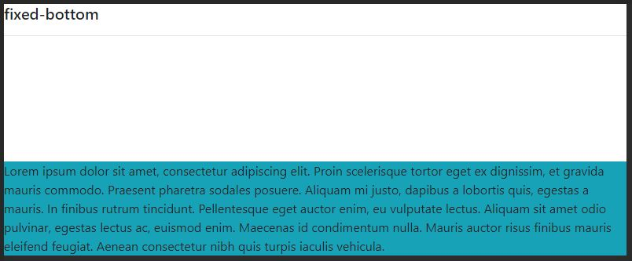
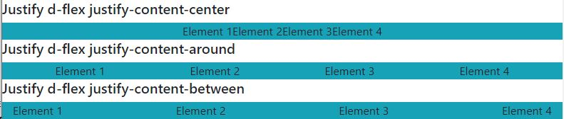
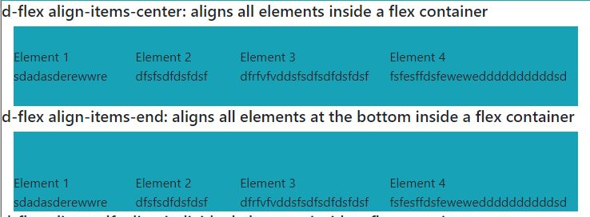
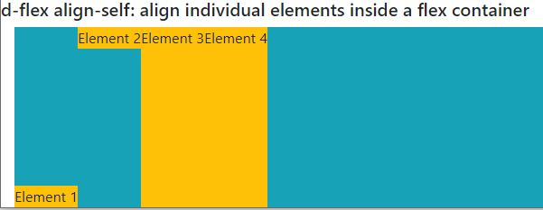
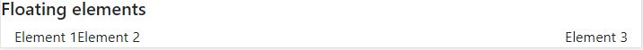
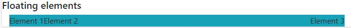

# 01-Layout

### 01.01 Basics

In order to work with layout in bootstrap you must use 3 main classes:
 - container
 - row
 - column

#### 01.01.01  Container

You can define container with a size like this:

```container-(size)```

Where size can be: sm, md, lg, xl, fluid

All containers add 15px of padding in both sides left and rigth. When adding rows and columns, that padding will de ignore (column will be 30px of padding but that's another history).

```html
<div class="container">
  <!-- Content here -->
</div>
```

 - ```.container``` and ```.container-sm``` 100% of width if screen is < 576px.
 - ```.container-md``` 100% of width until 768px.
 - ```.container-lg``` 100% of width until 992px.
 - ```.container-xl``` 100% of width until 1140px.
 - ```.container-fluid``` always will fill with 100% of width.

#### 01.01.02  Row & Col

row class inside a container.   
By default, create a row inside a container with -15px each side, left and right and col are created with a padding of. Adding `no-gutters` delete that margin and the columns padding.

Sample of a grid with row and col (note that the padding inside each column it's been ignored and the margin of the rows are being applied due to no-gutters):
```html
    <div class="container-fluid">
        Rows & col with no-gutters
        <div class="row no-gutters border border-primary">
            <div class="col-2 border border-secondary">
                Colum
            </div>
            <div class="col-2 border border-secondary">
                Colum
            </div>
            <div class="col-2 border border-secondary">
                Colum
            </div>
        </div>
    </div>
```


When we don't use `no-gutters`, the margin of the rows are ignored and the apdding of the columns are appplied:


We can use `row row-cols-N` to fit in each row N columns at maximun, here an example to fit 2 columns in each row (note that in this case the col class doesn't have the numbers):
```html
    <div class="container-fluid">
        <div class="row row-cols-2 no-gutters border border-primary">
            <div class="col border border-secondary">
                Colum1
            </div>
            <div class="col border border-secondary">
                Colum2
            </div>
            <div class="col border border-secondary">
                Colum3
            </div>
            <div class="col border border-secondary">
                Colum4
            </div>
            <div class="col border border-secondary">
                Colum5
            </div>
        </div>
    </div>
```


Can add `row row-cols-SIZE-N` where size == sm, md, lg, xl and N is the number of columns in each row.

Example where we show 1, 2, 3, 4 columns in each row depending on the screen size:
`row-cols-1` --> width < 576px (when width ≥ 576px, fit all columns it can)
`row-cols-sm-2` --> width ≥ 576px
`row-cols-md-3` --> width ≥ 768px
`row-cols-lg-4` --> width ≥ 992px
`row-cols-xl-5` --> width ≥ 1200px

```html
    <div class="container-fluid">
        <div class="row row-cols-1 row-cols-sm-2 row-cols-md-3 row-cols-lg-4 row-cols-xl-5 border border-primary">
            <div class="col border border-secondary">
                Colum1
            </div>
            <div class="col border border-secondary">
                Colum2
            </div>
            <div class="col border border-secondary">
                Colum3
            </div>
            <div class="col border border-secondary">
                Colum4
            </div>
            <div class="col border border-secondary">
                Colum5
            </div>
        </div>
    </div>
```

#### 01.01.03  Offset
In order to move the position of a column in the grid we can use the offset `offset-SIZE-N` where size == sm, md, lg, xl and N can take 1-11.

```html
    <div class="container-fluid">
        <div class="row border border-primary">
            <div class="col-4 border border-secondary">Normal col-4 div</div>
            <div class="col-4 offset-4 border border-secondary">This div has an offset-4, so include in the left 4 columns. </div>
        </div>
        <div class="row border border-primary">
            <div class="col-6 offset-3 border border-secondary">This div has an offset-3, so include in the left 3 columns. (a way to align in the center)</div>
        </div>
    </div>
```


#### 01.01.04  Order

Can apply class `order-SIZE-N` to columns to define the order of the columns inside a row. To apply differents order with differents width can apply a class like `class="col order-sm-3 order-md-2"`.

```html
    <div class="container-fluid">
        <div class="row">
            <div class="col order-sm-3 order-md-2">This is first col with order sm-3 and md-2</div>
            <div class="col order-sm-1 order-md-3">This is second col with order sm-1 and md-3</div>
            <div class="col order-sm-2 order-md-1">This is third col with order sm-2 and md-1</div>
        </div>
    </div>
```
>Important!
To avoid weird behaviour, apply order in all columns of a row. If you apply order only in some columns can apply or not depending on the case.

### 01.02 Alignment

#### 01.02.01  Vertical Align

To align all columns in the grid, there are a few classes you can add to the row:

`align-items-start`
`align-items-center`
`align-items-end`

```html
    <div class="container-fluid">
        <div class="row align-items-end">
            <div class="col-2 border border-secondary">Column1</div>
            <div class="col-2 border border-secondary">Column2</div>
            <div class="col-2 border border-secondary">Column3</div>
        </div>
    </div>
```


To use individual alignment of the columns can apply the new classes to the column:

`align-self-start`
`align-self-center`
`align-self-end`

```html
    <div class="container-fluid">
        <div class="row">
            <div class="col-2 align-self-start border border-secondary">Column1</div>
            <div class="col-2 align-self-center border border-secondary">Column2</div>
            <div class="col-2 align-self-end border border-secondary">Column3</div>
        </div>
    </div>
```


#### 01.02.02  Horizontal Align

To align all columns in the grid, there are a few classes you can add to the row.
>Important!
To apply this classes, make sure you use `col-N`, because doesn´t work with `col` classes.

`justify-content-start`
`justify-content-center`
`justify-content-end`
`justify-content-around` (try to put the same space betwwen all columns)
`justify-content-between` (put extra space between columns)

```html
    <div class="container-fluid">
        <div class="row justify-content-center bg-light">
            <div class="col-2 border border-secondary">Column1</div>
            <div class="col-2 border border-secondary">Column2</div>
            <div class="col-2 border border-secondary">Column3</div>
        </div>
    </div>
```


### 01.03 Position

#### 01.03.01 Position

These classes remove the element from the flow of the document.
 - `fixed-top` 
 - `fixed-bottom`
 - `sticky-top`

```html
    <h5>sticky-top</h5>
    <div class="container bg-danger">
        <div class="sticky-top bg-info">
            Lorem ipsum dolor sit amet, consectetur adipiscing elit. Proin scelerisque tortor eget ex dignissim, et gravida mauris commodo. Praesent pharetra sodales posuere. Aliquam mi justo, dapibus a lobortis quis, egestas a mauris. In finibus rutrum tincidunt.
            Pellentesque eget auctor enim, eu vulputate lectus. Aliquam sit amet odio pulvinar, egestas lectus ac, euismod enim. Maecenas id condimentum nulla. Mauris auctor risus finibus mauris eleifend feugiat. Aenean consectetur nibh quis turpis iaculis
            vehicula.
        </div>
        <div>
            ... lorem ipsum ...
        </div>
    </div>
```

fixed-bottom sample:
 

fixed-top sample:
 

 sticky-top sample (in this case the normal flow is respected at the begining except when the position div reaches the top document):
 
 
 

#### 01.03.02 Display properties

Open bootstrap to flexbos classes.

`d-SIZE-TYP`

Where TYPE display property can be:
 - `d-none`
 - `d-inline`
 - `d-inline-block`
 - `d-block`
 - `d-table`
 - `d-table-row`
 - `d-table-cell`
 - `d-flex`
 - `d-inline-flex`

`d-block` applies to each element and has 100% width, it appears to be an entire row.
```html
    <h5>d-block</h5>
    <div class="container bg-danger">
        <div class="d-block"> item d-block 1</div>
        <div class="d-block"> item d-block 2</div>
        <div class="d-block"> item d-block 3</div>
    </div>
```


`d-inline` applies to each element and put each element next to the other, take the width to show the element:
```html
    <h5>d-inline</h5>
    <div class="container bg-danger">
        <div class="d-inline border border-primary"> This is item d-inline 1</div>
        <div class="d-inline border border-primary"> item d-inline 2</div>
        <div class="d-inline border border-primary"> d-inline 3</div>
    </div>
```


### 01.03 Flex containers

To display elements as flex start introducing the main flex cointainer element:
`d-SIZE(-inline)-flex`

By default, `d-flex` flex elements are block-level elements, thats means each element will has 100% width an appears to be a row. We can put optionally the inline keyword `d-inline-flex` to put each element next to others.

The commmon point is that `d-flex` and `d-inline-flex` transform each children in flex items.

### 01.03.01 Direction 

Adding `flex(-SIZE)-DIR` to a flex container you can specify the direction as shown bellow:
- `flex-row` --> each item is a row, option by default when using d-flex
- `flex-column` --> each item is a column
- `flex-row-reverse`
- `flex-column-reverse`

```html
    <h5>Direction d-flex flex-column</h5>
    <div class="container-fluid bg-info">
        <div class="d-flex flex-column">
            <div>Element 1</div> <div>Element 2</div> <div>Element 3</div> <div>Element 4</div>
        </div>
    </div>
```


### 01.03.02 Order 

Use `order(-SIZE)-ORD` to specify the order of the elements. A number between 1-12.

### 01.03.03 Justifing 

Use `justify-content(-SIZE)-ALG`:
- `justify-content-start` --> element in left and extra space at the right
- `justify-content-end` --> element in right and extra space at the left
- `justify-content-center` --> center content horizontally
- `justify-content-around` --> try to put the same space betwwen all columns
- `justify-content-between` --> put extra space between columns

```html
    <h5>Justify d-flex justify-content-between</h5>
    <div class="container-fluid bg-info">
        <div class="d-flex justify-content-between">
            <div>Element 1</div> <div>Element 2</div> <div>Element 3</div> <div>Element 4</div>
        </div>
    </div>
```




### 01.03.04 Warp

Controls whether the elements wrap in the relation space in their container. `flex(-SIZE)-wrap(-reverse)`

 - `flex-wrap` --> the elements will be put in other line when it doesn't fit in the space
 - `flex-nowrap` --> option by default, all the content will fit one row

```html
    <h5>Warp d-flex flex-nowrap</h5>
    <div class="container-fluid bg-info">
        <div class="d-flex flex-nowrap">
            <div>Element 1 sdadasderewwre</div>
            <div>Element 2 dfsfsdfdsfdsf</div>
            <div>Element 3 dfrfvfvddsfsdfsdfdsfdsf</div>
            <div>Element 4 fsfesffdsfeweweddddddddddsd</div>
        </div>
    </div>
```

 

### 01.03.05 Vertical align

`align-items(-SIZE)-ALG`

 - `align-items-start`
 - `align-items-end`
 - `align-items-center`
 - `align-items-around`
 - `align-items-between`
 - `align-items-streech` --> make the elements fit within the container vertically.

 ```html
     <h5>d-flex align-items-center: aligns all elements inside a flex container</h5>
    <div class="container-fluid ">
        <div class="bg-info d-flex align-items-center" style="height: 100px;">
            <div>Element 1 sdadasderewwre</div> <div>Element 2 dfsfsdfdsfdsf</div>
            <div>Element 3 dfrfvfvddsfsdfsdfdsfdsf</div> <div>Element 4 fsfesffdsfeweweddddddddddsd</div>
        </div>
    </div>
    <h5>d-flex align-items-end: aligns all elements at the bottom inside a flex container</h5>
    <div class="container-fluid ">
        <div class="bg-info d-flex align-items-end" style="height: 100px;">
            <div>Element 1 sdadasderewwre</div> <div>Element 2 dfsfsdfdsfdsf</div>
            <div>Element 3 dfrfvfvddsfsdfsdfdsfdsf</div> <div>Element 4 fsfesffdsfeweweddddddddddsd</div>
        </div>
    </div>
```

 


### 01.04 Individual Flex elements

### 01.04.01 Individual vertical align

`align-items(-SIZE)-ALG`

 - `align-items-start`
 - `align-items-end`
 - `align-items-center`
 - `align-items-baseline`
 - `align-items-streech` --> option by default, make the elements fit within the container vertically.

 ```html
    <h5>d-flex align-self: align individual elements inside a flex container</h5>
    <div class="container-fluid ">
        <div class="bg-info d-flex" style="height: 200px;">
            <div class="bg-warning align-self-end">Element 1</div>
            <div class="bg-warning align-self-start">Element 2</div>
            <div class="bg-warning align-self-stretch">Element 3</div>
            <div class="bg-warning">Element 4</div>
        </div>
    </div>
```

 


### 01.05 Floating elements

`float(-SIZE)-SIDE`

 - `float-left`
 - `float-right`
 - `float-none`

When floating elements, the parent div loose the track of floated elements. To fix this, use clearfix in the parent element.
With no `clearfix` note that the bg-info div don't appear (that's because detect zero children and has no height and width):

 ```html
<h5>Floating elements without clearfix</h5>
    <div class="container-fluid ">
        <div class="bg-info">
            <div class="float-left">Element 1</div>
            <div class="float-left">Element 2</div>
            <div class="float-right">Element 3</div>
        </div>
    </div>
```
 

Nothe that with clearfix the gb-info div appears as expected:
 ```html
<h5>Floating elements with clearfix</h5>
    <div class="container-fluid ">
        <div class="bg-info clearfix">
            <div class="float-left">Element 1</div>
            <div class="float-left">Element 2</div>
            <div class="float-right">Element 3</div>
        </div>
    </div>
```
 


### 01.06 Visibility

`invisible` --> the element will not appear but it will still take the space it will normally takes
`visible` --> It's visible to screen readers (accesibility).

Remember that, in addition, the `d-none` class set the display property to none (it won't appear).

Combining `d-none visible` makes an element invisible but visible to screen readers.

### 01.06 Sizing

`SIZE-AMT`

Where SIZE:
 - `w`, `h`
 - `mw`
 - `mh-100` --> max height, the total amount of only can put 100 (not allow 25, 50)
 - `mw-100` --> max width, the total amount of only can put 100 (not allow 25, 50)
 - `vw-100` --> viewPort width: total width of the screen, the total amount of only can put 100 (not allow 25, 50)
 - `vh-100` --> viewPort height: total height of the screen, the total amount of only can put 100 (not allow 25, 50)


### 01.07 Borders

`border(-SIDE)(-COL)(-0)`

Where SIDE:
 - `top`, `right`, `bottom`, `left`

Where COL:
 - `primary`, `secondary`, `success`, `danger`, `warning`, `info`, `light`, `dark`, `white`


### 01.07.02 Rounded borders

`rounded(-SIDE)(-SHA)(-SIZ)`

Where SIDE:
 - `top`, `right`, `bottom`, `left`

Where SHA:
 - `circle`, `pill`

Where SIZ:
 - `0`, `sm`, `lg`


