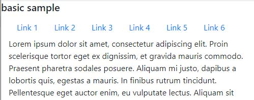
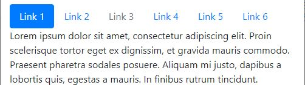
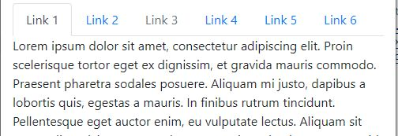
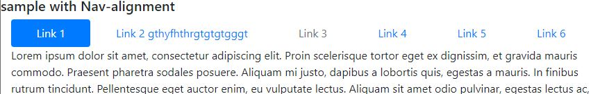
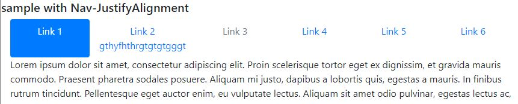
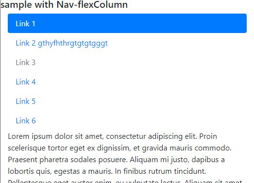

# 02-Navs and Navbar

### 02.01 Basic classes

To create navigation elements we can use two different methods:
 - Use `ul` element.
 - Use `navs` in regular divs.

Using UL: creating `nav` class inside the UL element and put the `nav-item` in the list-item, then inside the link use the `nav-link` class in a `a` (anchor) element.
 
Using Navs: inside the div with `nav` class add `nav-item` for each element of the menu, then inside the link use the `nav-link` class in a `a` (anchor) element.

Basic sample:
```html
<nav class="nav">
    <a href="#" class="nav-item nav-link">Link 1</a>
    <a href="#" class="nav-item nav-link">Link 2</a>
    <a href="#" class="nav-item nav-link">Link 3</a>
    <a href="#" class="nav-item nav-link">Link 4</a>
    <a href="#" class="nav-item nav-link">Link 5</a>
    <a href="#" class="nav-item nav-link">Link 6</a>
</nav>
```

```html
<ul class="nav">
    <li class="nav-item"><a href="#" class="nav-link">Link 1</a></li>
    <li class="nav-item"><a href="#" class="nav-link">Link 2</a></li>
    <li class="nav-item"><a href="#" class="nav-link">Link 3</a></li>
    <li class="nav-item"><a href="#" class="nav-link">Link 4</a></li>
    <li class="nav-item"><a href="#" class="nav-link">Link 5</a></li>
    <li class="nav-item"><a href="#" class="nav-link">Link 6</a></li>
</ul>
```



#### 02.01.01 Nav-link options
With the `nav-link` class you can use classes: 
 - `active`: show the link as active (only modify the appareance if the `nav` element has a style associated, see below)
 - `disable`: show the link as disable and the user can't click on it.

#### 02.01.02 Nav styles
With the `nav` class can use this options:
 - `nav-pills`: appears like little buttons with rounded edges
 - `nav-tabs`: appears like tabs.

Remember active need to nav element has defined an style.

```html
<ul class="nav nav-pills">
    <li class="nav-item"><a href="#" class="nav-link active">Link 1</a></li>
    <li class="nav-item"><a href="#" class="nav-link">Link 2</a></li>
    <li class="nav-item"><a href="#" class="nav-link disabled">Link 3</a></li>
</ul>
```
```html
<nav class="nav nav-pills">
    <a href="#" class="nav-item nav-link active">Link 1</a>
    <a href="#" class="nav-item nav-link">Link 2</a>
    <a href="#" class="nav-item nav-link disabled">Link 3</a>
</nav>
```


```html
<ul class="nav nav-tabs">
    <li class="nav-item"><a href="#" class="nav-link active">Link 1</a></li>
    <li class="nav-item"><a href="#" class="nav-link">Link 2</a></li>
    <li class="nav-item"><a href="#" class="nav-link disabled">Link 3</a></li>
</ul>
```



#### 02.01.03 Nav alignment
Can use flexbox classes to align the nav:
 - `justify-content-center`
 - `justify-content-end`: right align the nav content
 - `nav-fills`: want the links take the entire width of the container (The space of each link is going to be different depending on the width content/text).
 - `nav-justified`: force the space between each element to be the same, no matter the length of the text.
 - `flex-columns`: make the navigation more reponsive.

```html
<nav class="nav nav-pills nav-fill">
    <a href="#" class="nav-item nav-link active">Link 1</a>
    <a href="#" class="nav-item nav-link">Link 2 gthyfhthrgtgtgtgggt</a>
    <a href="#" class="nav-item nav-link disabled">Link 3</a>
    <a href="#" class="nav-item nav-link">Link 4</a>
    <a href="#" class="nav-item nav-link">Link 5</a>
    <a href="#" class="nav-item nav-link">Link 6</a>
</nav>
```




```html
<nav class="nav nav-pills nav-fill">
    <a href="#" class="nav-item nav-link active">Link 1</a>
    <a href="#" class="nav-item nav-link">Link 2 gthyfhthrgtgtgtgggt</a>
    <a href="#" class="nav-item nav-link disabled">Link 3</a>
    <a href="#" class="nav-item nav-link">Link 4</a>
    <a href="#" class="nav-item nav-link">Link 5</a>
    <a href="#" class="nav-item nav-link">Link 6</a>
</nav>
```



In the nex sample, the menu will be viewed as a row from sizes greater than sm:
```html
<nav class="nav nav-pills flex-column flex-sm-row">
    <a href="#" class="nav-item nav-link active">Link 1</a>
    <a href="#" class="nav-item nav-link">Link 2 gthyfhthrgtgtgtgggt</a>
    <a href="#" class="nav-item nav-link disabled">Link 3</a>
    <a href="#" class="nav-item nav-link">Link 4</a>
    <a href="#" class="nav-item nav-link">Link 5</a>
    <a href="#" class="nav-item nav-link">Link 6</a>
</nav>
```



 


