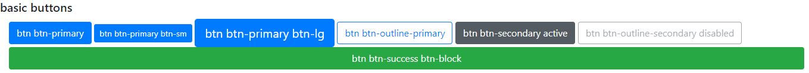
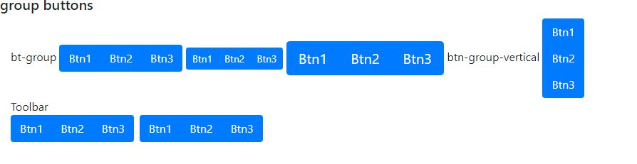
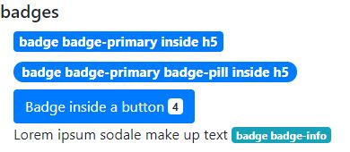
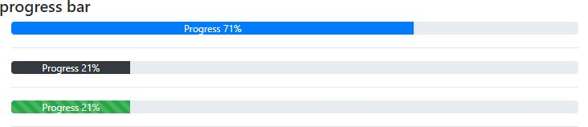

# 03-Style Elements

### 03.01 Buttons

The basic class to create a button is `btn` you can use it with `btn-sm` or `btn-lg` to specify the size.
Can use this class on these html elements: `<a>`, `<button>`, `<input>`

Then must specify colors can:
`btn-COL` or `btn-outline-COL` with COL:
 - primary
 - secondary
 - success
 - danger
 - warning
 - info
 - light
 - dark

Another options are:
 `btn-block`: the button fill all the width of the container
 `active`: for active buttons
 `disabled`: for disabled buttons

```html
<h5>basic buttons</h5>
<div class="container-fluid">
    <div class="row">
        <section class="col-12">
            <button class="btn btn-primary">btn btn-primary</button>
            <button class="btn btn-primary btn-sm">btn btn-primary btn-sm</button>
            <button class="btn btn-primary btn-lg">btn btn-primary btn-lg</button>
            <button class="btn btn-outline-primary">btn btn-outline-primary</button>
            <button class="btn btn-secondary active">btn btn-secondary active</button>
            <button class="btn btn-outline-secondary disabled">btn btn-outline-secondary disabled<button>
        </section>
    </div>
    <div class="row">
        <section class="col-12">
            <button class="btn btn-success btn-block">btn btn-success btn-block</button>
        </section>
    </div>
</div>
```


### 03.02 Group Buttons

To group simple buttons togther, you can use `btn-group` class. For group buttons in a stack use `btn-group-vertical`. For create groups of buttons groups, use `btn-toolbar` class.

```html
<div class="btn-toolbar">
    <div class="btn-group">
        <button type="button" class="btn btn-primary">Btn1</button>
        <button type="button" class="btn btn-primary">Btn2</button>
        <button type="button" class="btn btn-primary">Btn3</button>
    </div>
    <div class="btn-group">
        <button type="button" class="btn btn-primary">Btn1</button>
        <button type="button" class="btn btn-primary">Btn2</button>
        <button type="button" class="btn btn-primary">Btn3</button>
    </div>
</div>
```


Can use `btn-group-sm` or `btn-group-lg` to modify the goup size

```html
<div class="btn-group">
    <button type="button" class="btn btn-primary">Btn1</button>
    <button type="button" class="btn btn-primary">Btn2</button>
    <button type="button" class="btn btn-primary">Btn3</button>
</div>
<div class="btn-group btn-group-sm">
    <button type="button" class="btn btn-primary">Btn1</button>
    <button type="button" class="btn btn-primary">Btn2</button>
    <button type="button" class="btn btn-primary">Btn3</button>
</div>
<div class="btn-group btn-group-lg">
    <button type="button" class="btn btn-primary">Btn1</button>
    <button type="button" class="btn btn-primary">Btn2</button>
    <button type="button" class="btn btn-primary">Btn3</button>
</div>
```

### 03.03 Badges

Main class for badges is `badge`, in addition to that for a different shape can apply `badge-pill`. Also can use tradicional color classes `badge-COL` with COL: primary, secondary, success, danger, warning, info, light, dark.


```html
<h5>badges</h5>
<div class="container-fluid">
    <div class="row">
        <section class="col-12">
            <h5><span class="badge badge-primary">badge badge-primary inside h5</span></h5>
            <h5><span class="badge badge-primary badge-pill">badge badge-primary badge-pill inside h5</span></h5>
            <button type="button" class="btn btn-primary">
                Badge inside a button <span class="badge badge-light">4</span>
            </button>
            <p>Lorem ipsum sodale make up text <span class="badge badge-info">badge badge-info</span></p>
        </section>
    </div>
</div>
```



### 03.04 Progress bar

We need 2 set of tags. The main container has the `progress` class, then internally has other container with `progress-bar` class.

To control the width and height can use `w-25` and `h-25` (and so on classes).

Can use `bg-COL` classes to changes the color of progress bar. Also, there is an adittional class to control styles called `progress-bar-striped` and `progress-bar-animated`.

To handle accessibility use `role="progressbar"`to indicate this is a progress bar and `aria-value-now="20%"` to store the current value of the bar. `aria-value-min="0"` and `aria-value-max="100%"` indicates the min and max values of progress bar.


Note that setting with to 71% the progress bar fill at 71%
```html
<div class="progress">
    <div class="progress-bar" style="width: 71%;">Progress 71%</div>
</div>
<hr>
<div class="progress">
    <div class="progress-bar bg-dark" style="width: 21%;">Progress 21%</div>
</div>
<hr>
<div class="progress">
    <div class="progress-bar bg-success progress-bar-striped progress-bar-animated" style="width: 21%;">Progress 21%</div>
</div>
```




