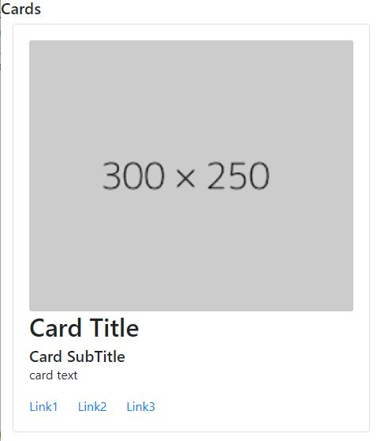

# 04-Layout Components

### 04.01 Jumbotron

Used to give a highlight to a section, commonly used at the top of the site.

Give to the principal container the class `jumbotron`. Using the class `jumbotron-fluid` takes the entire space of the parent and erase the rounded corners.

Note: for align content inside, you need to add an aditional container and add aditional styles to it.

Different exampls of jumbotron disposition

```html
<div class="container mt-2">
    <div class="jumbotron">
        <h5>Jumbotron</h5>
        This is my jumbotron acting like a header of the page
    </div>
</div>
```


```html
<div class="jumbotron jumbotron-fluid">
    <div class="container">
        <h5>Jumbotron</h5>
        This is my jumbotron acting like a header of the page, note that this one occupies all the space in parent and the coners aren`t rounded
    </div>
</div>
```


### 04.02 Table styles

To give some styles to a table, add the class `table` to the table html element itself. 
Aditionally, there are a number of classes that can be added to the basic table class, so the look can change:
 - `table-dark` gives a dark background and light text to the table.
 - `table-striped` changes color background for the rows in the table.
 - `table-bordered` put a border around the entire table.
 - `table-borderless` delete the underlines borders.
 - `table-hover` changes the color of the rows when hover with mouse.

Add colors in the header of the table with:
 - `thead-light`
 - `thead-dark`

Changes the color of all tr and td with `table-COL` active, primary, secondary, success, danger, warning, info, light, dark.

To change the color of tr and td but using more dark colors use `bg-COL` primary, success, danger, warning, info.

To mosify the text color use `text-COL` primary, secondary, success, danger, warning, info, light, dark.

Adding this classes to the table html element will control the size of the table:
 - `table-sm`
 - `talbe-responsive-SIZE` sm, md, lg, xl

```html
<table class="table table-striped table-hover table-bordered table-responsive">
    <thead class="thead-dark">
        <tr>
            <th scope="col">Item #</th>
            <th scope="col">Product or Service</th>
            <th scope="col">Price (ea.)</th>
            <th scope="col">Retail Price (Case)</th>
        </tr>
    </thead>
    <tbody>
        <tr class="bg-info text-dark">
            <th scope="row">100050</th>
            <td>Advance Pet Oral Care Toothbrush and Toothpaste</td>
            <td>$9.55 </td>
            <td>$108.87</td>
        </tr>
        <tr>
            <th scope="row">100043</th>
            <td>Basic Teeth Cleaning and Exam</td>
            <td>$100.00 </td>
            <td>$1,140.00</td>
        </tr>
        <tr>
            <th scope="row">100013</th>
            <td class="table-success">Calm Cat Anxiety Relief Spray</td>
            <td>$9.49 </td>
            <td>$108.19</td>
        </tr>
    </tbody>
</table>
```


### 04.03 Cards Layout

Create a container that has a card layout.

##### 04.03.01 Cards basics

Asign to the main container the class `card`. Inside of that container we must have another container with the class `card-body`. In addition, we can have containers with `card-header` and `card-footer` class.

Inside the card-body we gonna have a series of classes that will identify the type of content.
`card-text`, `card-title`, `card-subtitle`, `card-link`, `card-img`. Theses classes give the content the proper alignment.

We can use the traditional classes for backgrounds, border and text: bg-COL, border-COL, text-COL.


```html
<section class="card">
    <div class="card-body">
        
        <h2 class="card-title">Card Title</h2>
        <h5 class="card-subtitle">Card SubTitle</h5>
        <p class="card-text">card text</p>
        <a class="card-link" href="#">Link1</a>
        <a class="card-link" href="#">Link2</a>
        <a class="card-link" href="#">Link3</a>
    </div>
</section>
```




##### 04.03.02 Card contents

Inside of the basic `card` container we should have a `card-body` container, but in addition, we can have containers with `card-header` and `card-footer` class.

In adition to `card-img` we can have `card-img-top`, `card-img-bottom` or `card-img-overlay` (this last one in case we want text that sits on the top of an image).

FYI, its very common to use list-group elements inside a card.

```html
<section class="card">
    <div class="card-header">
        <h2 class="card-title">Card Title</h2>
        <h5 class="card-subtitle">Card SubTitle</h5>
    </div>
    <div class="card-body">
        
        <p class="card-text">card text </p>
    </div>
    <div class="card-footer">
        <a class="card-link" href="#">Link1</a>
        <a class="card-link" href="#">Link2</a>
        <a class="card-link" href="#">Link3</a>
    </div>
</section>
```


Note that `card-img-top` its used outside of card-body and  this make the image takes all the width of the card wihtout a padding.

```html
<section class="card">
    
    <div class="card-body">
        <h2 class="card-title">Card Title</h2>
        <h5 class="card-subtitle">Card SubTitle</h5>
        <p class="card-text">card text </p>
        <a class="card-link" href="#">Link1</a>
        <a class="card-link" href="#">Link2</a>
        <a class="card-link" href="#">Link3</a>
    </div>
</section>
```


Note that using a `card-img` and `card-img-overlay` instead of card-body we can use an image as background of the card.

```html
<section class="card">
    
    <div class="card-img-overlay">
        <h2 class="card-title">Card Title</h2>
        <h5 class="card-subtitle">Card SubTitle</h5>
        <p class="card-text">card text </p>
        <a class="card-link" href="#">Link1</a>
        <a class="card-link" href="#">Link2</a>
        <a class="card-link" href="#">Link3</a>
    </div>
</section>
```


This is how to use a list-group inside a card. Note that the `a` elements doesn't have the card-link class anymore and they are list-group-item. `list-group-flush` is used to fit the borders of the list-group with the borders of the card (for example tansforming the top rounded borders in corners).
```html
<section class="card">
    
    <div class="card-body">
        <h2 class="card-title">Card Title</h2>
        <h5 class="card-subtitle">Card SubTitle</h5>
        <p class="card-text">card text </p>
    </div>
    <div class="list-group list-group-flush">
        <a class="list-group-item" href="#">Link1</a>
        <a class="list-group-item" href="#">Link2</a>
        <a class="list-group-item" href="#">Link3</a>
    </div>
</section>
```


##### 04.03.03 Card layouts


There are 3 layout container classes you can use:

 - `card-group` similar to button group but with cards, the cards will show together and share borders.
 - `card-deck` add spaces between the columns.
 - `card-columns` alternative lauyout

Aditionally, we can use the grid (containers, rows and columns) with special mention to `row-cols-SIZE-COLUMNS` that was speciic created for cards. COLUMNS goes from 1 to 6.

```html
<!-- card-group or card-deck in the principal container -->
<div class="card-group">
    <div class="card">
        
        <div class="card-body">
            <h4 class="card-title">Title</h4>
            <p class="card-text">Text</p>
        </div>
    </div>
    <div class="card">
        
        <div class="card-body">
            <h4 class="card-title">Title</h4>
            <p class="card-text">Text</p>
        </div>
    </div>
    <div class="card">
        
        <div class="card-body">
            <h4 class="card-title">Title</h4>
            <p class="card-text">Text</p>
        </div>
    </div>
</div>
```

This image shows the difference between `card-group` and `card-deck`


