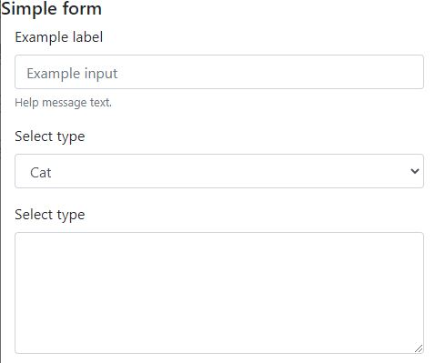
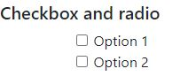
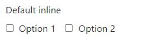
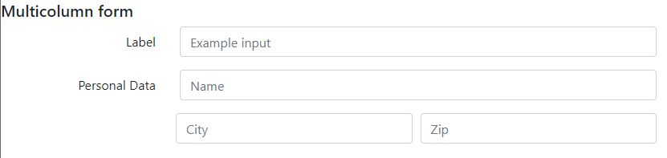
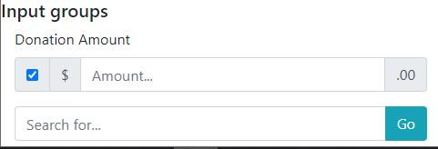

# 05-Forms

### 05.01 Basics


The basic way to create a form an group elements is to use `form` class. This class can be applied to any block element like divs add a little spacing at the bottom of the element. 

Important --> applies to the group a display block, forms will by default stack vertically.

Another two classes you can use for input basic text
 - `form-group`: add basic structure to the form that groups labels, controls, optional help text, validationg messaging...
 - `form-text`: for help text below inputs (display block and add some top margin)
 - `form-control`: for basic text input fields (inputs, select and text-areas).
 - `form-control-label`: labels inside form-group (important to form validation later!)
 - `form-control-file`: for file inputs.

```html
<h5>Simple form</h5>
<div class="container mb-2">
    <form>
        <div class="form-group">
            <label class="form-control-label" for="inputtext">Example label</label>
            <input type="text" class="form-control" id="inputtext" placeholder="Example input">
            <small id="helper" class="form-text text-muted">
                Help message text.
            </small>
        </div>
        <div class="form-group">
            <label class="form-control-label" for="selectType">Select type</label>
            <select class="form-control" id="selectType">
                <option value="cat">Cat</option>
                <option value="dog">dog</option>
            </select>
        </div>
        <div class="form-group">
            <label class="form-control-label" for="areatext">Select type</label>
            <textarea class="form-control" id="areatext" cols="30" rows="5"></textarea>
        </div>
    </form>
</div>
```




### 05.02 Checkbox & radio

 - `form-check`: the main container for these 2 types of input is  (don't use form-group). 
 - `form-check-label`: for labels that belongs to these type of fields.
 - `form-check-input`: for checkbox or radio input itself.
 - `form-check-inline`: by default these are elements displayed as block, use this if you want appears side by side

It seems that these classes don't change the appareance very much, buy it's important to the messages validations.

```html
<div class="container mb-2">
    <form>
        <div class="form-group">
            <label>Default checks </label>
            <div class="form-check">
                <label class="form-check-label">
                    <input type="checkbox" class="form-check-input">
                    Option 1
                </label>
            </div>
            <div class="form-check">
                <label class="form-check-label">
                    <input type="checkbox" class="form-check-input">
                    Option 2
                </label>
            </div>
        </div>
    </form>
</div>
```



Note here we put the label `d-block` class to avoid all in the same line.
```html
<form>
    <div class="form-group">
        <label class="d-block">Default inline </label>
        <div class="form-check form-check-inline">
            <label class="form-check-label">
                <input type="checkbox" class="form-check-input">
                Option 1
            </label>
        </div>
        <div class="form-check form-check-inline">
            <label class="form-check-label">
                <input type="checkbox" class="form-check-input">
                Option 2
            </label>
        </div>
    </div>
</form>
```



```html
<form>
    <div class="form-group">
        <label>Radio </label>
        <div class="form-check">
            <label class="form-check-label">
                <input type="radio" name="RadioName" class="form-check-input">
                Radio 1
            </label>
        </div>
        <div class="form-check">
            <label class="form-check-label">
                <input type="radio" name="RadioName" class="form-check-input">
                Radio 2
            </label>
        </div>
    </div>
</form>
```


### 05.03 Style options

 - `form-control-sm` `form-control-lg`: input field smaller or bigger.
 - `form-inline`: to put the group in the same line.

```html
<div class="form-group form-inline">
    <label class="form-control-label" for="inputtext">Example label</label>
    <input type="text" class="form-control form-control-sm" id="inputtext" placeholder="Example input">
</div>
```

### 05.04 Multicolumn forms

For build a multicolumn form let's use column grid. 

> We don't need to add a container on forms, simply start adding a row and columns inside the rows.

Special classes we can use:
 - `form-row`: modified version of row that gives less spaces between columns.
 - `col-auto`: automatically determine the width of the column depending on the element you are including.
 - `col-form-label`: add to any label in the layouts.


Note we don't use in the samples form-control-label for labels, instead we're using `col-form-label`.
Note that the third row has nested `form-group` divs, that add some extra space that it's fixed with col class. Adding two div with `col` space divide the space in 2 (this is normal grid behaviour).

```html
<h5>Multicolumn form</h5>
<div class="container-fluid mb-2">
    <form>
        <div class="form-group row">
            <label class="col-form-label text-sm-right col-sm-3" for="inputtext">Label</label>
            <div class="col-sm-9">
                <input type="text" class="form-control" id="inputtext" placeholder="Example input">
            </div>
        </div>
        <div class="form-group row">
            <label class="col-form-label text-sm-right col-sm-3" for="inputtext2">Personal Data</label>
            <div class="col-sm-9">
                <input type="text" class="form-control" id="inputtext2" placeholder="Name">
            </div>
        </div>
        <div class="form-group form-row">
            <div class="form-group offset-sm-3 col"> <!-- Use offset to align with previous fields -->
                <input type="text" class="form-control" id="inputtext3" placeholder="City">
            </div>
            <div class="form-group col">
                <input type="text" class="form-control" id="inputtext3" placeholder="Zip">
            </div>
        </div>
    </form>
</div>
```




### 05.05 Input Groups

Allows to create form elements in horizontal layouts.

> Bootstrap don't support multiple form-controls in a single input group and <label>s must come outside the input group.

 - `input-group`: define an input group.
 - `input-group-prepend`: add items at the beginning of the input group.
 - `input-group-append`: add item at the end of the input group.
 - `input-group-text`: any element (button, checkbox, text,...) placed inside the input group (append or prepend) must have this class.

 ```html
<form>
    <div class="form-group">
        <label class="form-control-label">Donation Amount</label>
        <div class="input-group">
            <div class="input-group-prepend">
                <div class="input-group-text">
                    <input type="checkbox" id="confirm-check" checked>
                </div>
                <div class="input-group-text">$</div>
            </div>
            <input type="text" class="form-control" placeholder="Amount...">
            <div class="input-group-append">
                <div class="input-group-text">.00</div>
            </div>
        </div>
    </div>
    <div class="input-group">
        <input class="form-control" type="text" id="search" placeholder="Search for...">
        <div class="input-group-append">
            <button type="button" class="btn btn-info">Go</button>
        </div>
    </div>
</form>
 ```



 
