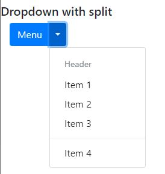
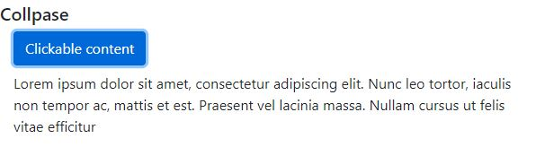
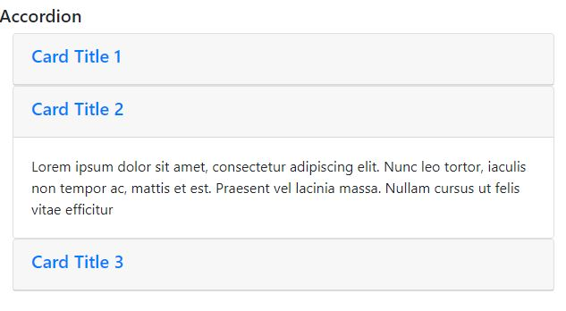

# 06-Interactive Components

### 06.01 Tooltips

Only use tooltips in html elements that are focusable like links, buttons or form buttons.


To setup the tooltip add `data-toggle="tooltip"` attribute to the html element and then add the `title` attribute with some text in it.

Tooltip can be configurable in 2 ways, you can use `data` attribute (it's a lot easier and is waht we are using here) or JavaScript configuration. Even using `data` attribute, by default tooltips are not enabled, so for enabling it you must use JavaScript activation.


Options can use in tooltip (alls are attributes of html elements):
 - data-placement: top, right, bottom, left.
 - data-trigger: hover (by default), click, focus.
 - data-html: true, false. 

This is for enable tooltips with jQuery
```html
<html lang="en">
    <head>
        ...
    </head>

    <body>
        ...
    </body>

    <script>
        $(function() {
            $('[data-toggle="tooltip"]').tooltip(); // this function can receive options object.
        });
    </script>
</html>
```

Using the tooltip
```html
<div class="container-fluid mb-2">
    <p>
    Lorem ipsum dolor sit amet, consectetur adipiscing elit. <a href="#" data-toggle="tooltip" data-placement="left" title="This is my tooltip">Phasellus dapibus</a> convallis nisi a commodo. Praesent vitae rhoncus lectus, a ornare neque. Duis ut metus molestie, accumsan neque non, rhoncus augue.
    </p>
</div>
```


### 06.02 PopOvers

Let's us display aditional content triggered by events like click. There're very similar to tooltips, but they have different styles.

To setup, simply use attribute `data-toggle="popover"` in the html element and then add `title` attribute with the text you want to show. Also use `data-content="content"` to add aditional content (the title will be the headline and the content fill be some sort of sub-content).

In order to activate or enabling you have to do in a similiar way of tooltips.

Options can use in tooltip (alls are attributes of html elements):
 - data-placement: top, right (by default), bottom, left.
 - data-trigger: hover, click (by default), focus.
 - data-container: defines the container the popover will be attached to.

```html
<html lang="en">
    <head>
        ...
    </head>

    <body>
        ...
    </body>

    <script>
        $(function() {
            $('[data-toggle="popover"]').popover(); // this function can receive options object.
        });
    </script>
</html>
```

```html
<div class="container-fluid mb-3">
    <button class="btn btn-info" data-toggle="popover" title="Info" data-content="Some more deatiled info" data-placement="bottom">
        More Info
    </button>
</div>
```


### 06.03 Alerts

Alerts are meant to simple content, so try son't use crazy html tags in. Use the class `alert` inside a container. You should use it combined with `alert-COL` (primary, secondary, success, danger, warning, info, light, dark).

For internal content of the alert can use `alert-heading` and `alert-link`.

Can do an alert dismissible for the user using the class `alert-dismissible fade show` (the classes fade and show are for animations when dismisind the alert). You should add a close button for dismiss the alert.

```html
<div class="alert alert-info alert-dismissible fade show">
    <button type="button" class="close" data-dismiss="alert">
        <span>&times;</span>
    </button>
    <h5 class="alert-heading">Title</h5>
    <p>
        Lorem ipsum dolor sit amet, consectetur adipiscing elit. Phasellus dapibus convallis nisi a commodo. Praesent vitae rhoncus lectus, a ornare neque. Duis ut metus molestie, accumsan neque non, rhoncus augue.
    </p>
    <a href="#" class="alert-link">Info</a>
</div>
```


### 06.04 Dropdowns

You can use dropdpwn in a lot of different components like navs, tabs, buttons,... 

The dropdowns are created in 2 parts: 
 - Create the element that will trigger the dropdown, like a button.
 - Create the dropdown content itself.

For the menu you can use either links or buttons.

Classes involve in creating the dropdown:
 - `dropdown`: on the container that holds both the trigger and the content
 - `dropdown-toggle`: on the button that trigger the menu.
 - `dropdown-menu`: the container for the menu.
 - `dropdown-item`: for each menu item (either a link or a button).

Inside the menu you can add few elements using this clases:
 - `dropdown-header`: title for a group or elements.
 - `dropdown-divider`: create an horizontal line for a division.
 - `disabled`: menu item that's disabled.

For control how things look:
 - `bnt-sm` or `btn-lg`: this goes in the trigger for the menu and control the size of the trigger button.
 - `dropup`:  the menu appears above the trigger menu instead of bottom.
 - `dropdown-menu-right`: Aling the menu to the right (left is by default).
 - `btn-group` and `dropdown-toggle-split`: the dropdown and menu are split

```html
<!-- can use dropup -->
<div class="dropdown">
    <!-- trigger for the menu -->
    <button class="btn btn-primary btn-sm dropdown-toggle" data-toggle="dropdown" type="button"> 
        Menu
    </button>
    <div class="dropdown-menu">
        <div class="dropdown-header">Header</div>
        <a class="dropdown-item" href="#">Item 1</a>
        <a class="dropdown-item" href="#">Item 2</a>
        <a class="dropdown-item" href="#">Item 3</a>
        <div class="dropdown-divider"></div>
        <a class="dropdown-item" href="#">Item 4</a>
    </div>
</div>
```


Create a split button for the dropdown: 
 - instead of a `dropdown` class create a `btn-group` (the first button has the text and the second will be the split)
 - add the second button `dropdown-toggle dropdown-toggle-split`

```html
<div class="btn-group">
    <!-- trigger for the menu -->
    <button type="button" class="btn btn-primary">Menu</button>
    <button class="btn btn-primary btn-sm dropdown-toggle dropdown-toggle-split" data-toggle="dropdown" type="button"></button>
    <div class="dropdown-menu">
        <div class="dropdown-header">Header</div>
        <a class="dropdown-item" href="#">Item 1</a>
        <a class="dropdown-item" href="#">Item 2</a>
        <a class="dropdown-item" href="#">Item 3</a>
        <div class="dropdown-divider"></div>
        <a class="dropdown-item" href="#">Item 4</a>
    </div>
</div>
```




### 06.05 Collapse & accordions

Component that allow us to show or hide content. 
 - Create a link or a button and add the attribute `data-toggle="collapse"` That`s the element that will collapse the content.
 - To set the target content use `href="#id"` if you are using a link or `data-target` attribute if using a button.
 - The element that will be showed or hided must have the `collapse` class.

Note that we use a button to make the collapse, so we use data-target attribute 

```html
<button type="button" class="btn btn-primary mb-2" 
        data-toggle="collapse" 
        data-target="#collapsableContent">
    Clickable content
</button>
<div id="collapsableContent" class="collapse">
    Lorem ipsum dolor sit amet, consectetur adipiscing elit. Nunc leo tortor, iaculis non tempor ac, mattis et est. Praesent vel lacinia massa. Nullam cursus ut felis vitae efficitur
</div>
```




### 06.06 Accordions

Accordions are in essencial a set of collapsers.
 - It requires a container.
 - Only one of the elements of the container should be visible so we add the `show` class (only once elemnt at a time).
 - Need to add the `collapse-menu` class to all collapsible content (and add `show` the content open by default).
 - It's common to put the content inside a `card` class.
 - Add data-toggle="collapse" attribute to all buttons or links that are clickable.
 - Add `data-parent="#id"` attribute to all collapsible content, where id is the id of the main accordion content.


```html
<div id="accordionContainer"> <!-- Principal container of accordion -->
    <section class="card">
        <div class="card-header" id="card1Header">
            <h5>
                <a href="#Card1" data-toggle="collapse">Card Title 1</a>
            </h5>
        </div>
        <div id="Card1" class="collapse show" data-parent="#accordionContainer">
            <div class="card-body">
                <p class="card-text">Lorem ipsum dolor sit amet, consectetur adipiscing elit. Nunc leo tortor, iaculis non tempor ac, mattis et est. Praesent vel lacinia massa. Nullam cursus ut felis vitae efficitur</p>
            </div>
        </div>
    </section>
    <section class="card">
        <div class="card-header" id="card2Header">
            <h5>
                <a href="#Card2" class="collapsed" data-toggle="collapse">Card Title 2</a>
            </h5>
        </div>
        <div id="Card2" class="collapse" data-parent="#accordionContainer">
            <div class="card-body">
                <p class="card-text">Lorem ipsum dolor sit amet, consectetur adipiscing elit. Nunc leo tortor, iaculis non tempor ac, mattis et est. Praesent vel lacinia massa. Nullam cursus ut felis vitae efficitur</p>
            </div>
        </div>
    </section>
    <section class="card">
        <div class="card-header" id="card3Header">
            <h5>
                <a href="#Card3" class="collapsed" data-toggle="collapse">Card Title 3</a>
            </h5>
        </div>
        <div id="Card3" class="collapse" data-parent="#accordionContainer">
            <div class="card-body">
                <p class="card-text">Lorem ipsum dolor sit amet, consectetur adipiscing elit. Nunc leo tortor, iaculis non tempor ac, mattis et est. Praesent vel lacinia massa. Nullam cursus ut felis vitae efficitur</p>
            </div>
        </div>
    </section>
</div>
```




### 06.07 Toast

Notifications

 - Create a container with the class `toast`.
 - Inside the container add elements with `toast-header` and `toast-body` classes to add header and body.
 - In the toast header usually you put something to close the toast.

 In the main container `toast` you can add this attributes:
  - `animation="false"` (by default it's set to true)
  - `autohide="false"` (by default it's set to true)
  - `dealy=500` (tells the toast how long stay in the screen)
  - `data-dismiss="toast"` (if you modify the toast so it doesn't dissapears after few seconds)

By default the toast has't any position, so you have to set it manually.

Remember to enable toast using jquery.

### 06.08 Stretched links

Make an html element clickable its whole. Adding class `stretched-link` to a link to make its containing block clickable. This means that the element must have position: relative to stretched-link works.

If the stretched link doesn’t seem to work, the containing block will probably be the cause.

 - Columns are position: relative by default, so clickable columns only require the .stretched-link class. However, stretching a link over an entire .row requires .position-static on the column and .position-relative on the row.
 - Media objects do not have position: relative by default, so we need to add the .position-relative in the media div.
 - Cards have position: relative by default so you can safely add the ``stretched-link` class.


```html
<div class="card" style="width: 18rem;">
    <div class="card-body">
        <h5 class="card-title">Card with stretched link</h5>
        <p class="card-text">Some quick example text to build on the card title and make up the bulk of the card's content.</p>
        <a href="#" class="btn btn-primary stretched-link">Go somewhere</a>
    </div>
</div>
```


