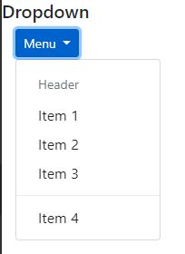

# 06-Interactive Components

### 06.01 Tooltips

Only use tooltips in html elements that are focusable like links, buttons or form buttons.


To setup the tooltip add `data-toggle="tooltip"` attribute to the html element and then add the `title` attribute with some text in it.

Tooltip can be configurable in 2 ways, you can use `data` attribute (it's a lot easier and is waht we are using here) or JavaScript configuration. Even using `data` attribute, by default tooltips are not enabled, so for enabling it you must use JavaScript activation.


Options can use in tooltip (alls are attributes of html elements):
 - data-placement: top, right, bottom, left.
 - data-trigger: hover (by default), click, focus.
 - data-html: true, false. 

This is for enable tooltips with jQuery
```html
<html lang="en">
    <head>
        ...
    </head>

    <body>
        ...
    </body>

    <script>
        $(function() {
            $('[data-toggle="tooltip"]').tooltip(); // this function can receive options object.
        });
    </script>
</html>
```

Using the tooltip
```html
<div class="container-fluid mb-2">
    <p>
    Lorem ipsum dolor sit amet, consectetur adipiscing elit. <a href="#" data-toggle="tooltip" data-placement="left" title="This is my tooltip">Phasellus dapibus</a> convallis nisi a commodo. Praesent vitae rhoncus lectus, a ornare neque. Duis ut metus molestie, accumsan neque non, rhoncus augue.
    </p>
</div>
```


### 06.02 PopOvers

Let's us display aditional content triggered by events like click. There're very similar to tooltips, but they have different styles.

To setup, simply use attribute `data-toggle="popover"` in the html element and then add `title` attribute with the text you want to show. Also use `data-content="content"` to add aditional content (the title will be the headline and the content fill be some sort of sub-content).

In order to activate or enabling you have to do in a similiar way of tooltips.

Options can use in tooltip (alls are attributes of html elements):
 - data-placement: top, right (by default), bottom, left.
 - data-trigger: hover, click (by default), focus.
 - data-container: defines the container the popover will be attached to.

```html
<html lang="en">
    <head>
        ...
    </head>

    <body>
        ...
    </body>

    <script>
        $(function() {
            $('[data-toggle="popover"]').popover(); // this function can receive options object.
        });
    </script>
</html>
```

```html
<div class="container-fluid mb-3">
    <button class="btn btn-info" data-toggle="popover" title="Info" data-content="Some more deatiled info" data-placement="bottom">
        More Info
    </button>
</div>
```


### 06.03 Alerts

Alerts are meant to simple content, so try son't use crazy html tags in. Use the class `alert` inside a container. You should use it combined with `alert-COL` (primary, secondary, success, danger, warning, info, light, dark).

For internal content of the alert can use `alert-heading` and `alert-link`.

Can do an alert dismissible for the user using the class `alert-dismissible fade show` (the classes fade and show are for animations when dismisind the alert). You should add a close button for dismiss the alert.

```html
<div class="alert alert-info alert-dismissible fade show">
    <button type="button" class="close" data-dismiss="alert">
        <span>&times;</span>
    </button>
    <h5 class="alert-heading">Title</h5>
    <p>
        Lorem ipsum dolor sit amet, consectetur adipiscing elit. Phasellus dapibus convallis nisi a commodo. Praesent vitae rhoncus lectus, a ornare neque. Duis ut metus molestie, accumsan neque non, rhoncus augue.
    </p>
    <a href="#" class="alert-link">Info</a>
</div>
```


### 06.04 Dropdowns

You can use dropdpwn in a lot of different components like navs, tabs, buttons,... 

The dropdowns are created in 2 parts: 
 - Create the element that will trigger the dropdown, like a button.
 - Create the dropdown content itself.

For the menu you can use either links or buttons.

Classes involve in creating the dropdown:
 - `dropdown`: on the container that holds both the trigger and the content
 - `dropdown-toggle`: on the button that trigger the menu.
 - `dropdown-menu`: the container for the menu.
 - `dropdown-item`: for each menu item (either a link or a button).

Inside the menu you can add few elements using this clases:
 - `dropdown-header`: title for a group or elements.
 - `dropdown-divider`: create an horizontal line for a division.
 - `disabled`: menu item that's disabled.

For control how things look:
 - `bnt-sm` or `btn-lg`: this goes in the trigger for the menu and control the size of the trigger button.
 - `dropup`:  the menu appears above the trigger menu instead of bottom.
 - `dropdown-menu-right`: Aling the menu to the right (left is by default).
 - `btn-group` and `dropdown-toggle-split`: the dropdown and menu are split

```html
<!-- can use dropup -->
<div class="dropdown">
    <!-- trigger for the menu -->
    <button class="btn btn-primary btn-sm dropdown-toggle" data-toggle="dropdown" type="button"> 
        Menu
    </button>
    <div class="dropdown-menu">
        <div class="dropdown-header">Header</div>
        <a class="dropdown-item" href="#">Item 1</a>
        <a class="dropdown-item" href="#">Item 2</a>
        <a class="dropdown-item" href="#">Item 3</a>
        <div class="dropdown-divider"></div>
        <a class="dropdown-item" href="#">Item 4</a>
    </div>
</div>
```



