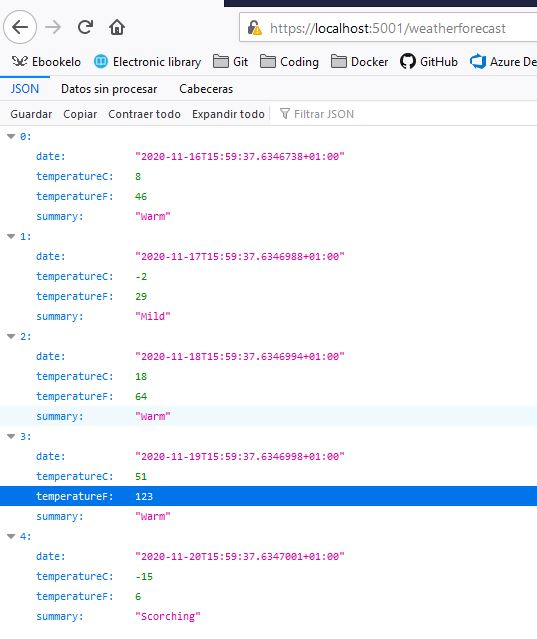

## 1-Fundamentals

To execute the API:
```dotnet run```

To access the controller:
```https://localhost:5001/weatherforecast```

See the JSON returned in a browser:



#### 1.01 REST

REST stands for: 
> Representational State Transfer

Rest isn't a technology, it's a design concept. A programming paradigm built on top of HTTP. The idea is use URIs to access resources. And Rest uses HTTP to give us functionality like http verbs, or http headers.

Contrains:
 * It's uniform, so we must have one URI for each resource.
 * It's client-server: that means the client and the server are differents.
 * It's stateless
 * Can be cached.
 * Need layered system: rest it's a layer of the architecture.
 * Code on demand: you can return code that will be execute on the client (in addition to return data).


 #### 1.02 Controllers & Actions

##### 1.02.01 ControllerBase

Our contoller inherits from a class named `ControllerBase` that is an MVC controller without view support. In Web applications we use `Controller` class that has support for Views, but in Web APIs we don't have views. We don't need stuff like `View(...)` or `PartialView(...)` so ControllerBase is enough.

`ControllerBase` inherints from `Controller`.

Info about ControllerBase: https://docs.microsoft.com/en-us/dotnet/api/microsoft.aspnetcore.mvc.controllerbase?view=aspnetcore-5.0

Info about Controller: https://docs.microsoft.com/en-us/dotnet/api/microsoft.aspnetcore.mvc.controller?view=aspnetcore-5.0

```C#
public class WeatherForecastController : ControllerBase
{
    ...
}
```

##### 1.02.02 Class Attribute

Alternative, we have an `[ApiController]` class attribute that give us some features like automatic model validation, specific HTTP errors code,..

```C#
[ApiController]
[Route("[controller]")] // See routing for this attribute class
public class WeatherForecastController : ControllerBase
{
    ...
}
```

With `[ApiController]` we can now specify an attribute as required in the model and the Web Api will check it automaticly:
```C#
public class MyModel
{
    [Required]
    public string Name { get; set; }
}
```

Also this class attribute affect to the binding attributes: when a post method receive a complex type, it will be assumed automatically that the data will be received in the body and for the get methods the simple types will be received in the query.

```C#
// Class mark with [ApiController]

    // By default [FromBody] because it's an HttpPost and receive a complex type
    [HttpPost]
    public IActionResult Post(WeatherForecast obj) 
    {
        return Ok();
    }

    // By default Get receives simple types in the URL [FromQuery]
    [HttpGet]
    public IActionResult Get(int id)
    {
        return Ok();
    }
```

##### 1.02.03 Actions

If the method it's colled Get, Post, Delete,... automatically the verb used to calls that actions are the specified by its name. For example an action called Post will need an http post request.

The same for actions for witch names strats with Get, Post, Put... for example the action `PutProduct(Product p)` will need an http Put request.

Alternaty, we can explicity indicate the http needed for an action using method attributes. For example `[HttpGet]` indicate the action uses Get verb.

```C#
// This uses Post even if the name starts with Get...
[HttpPost]
public WeatherForecast GetMyWeatherForecast(int id) 
{
        
}
```